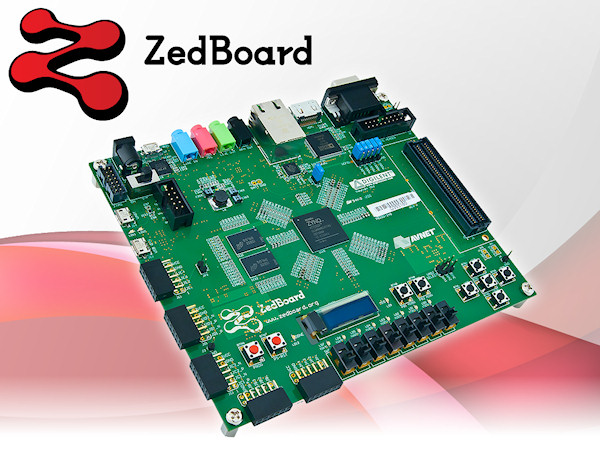

# SOPC Design Practice And FPGA System Design

## Homeworks

 Hws   | Descriptions
--------|:-----
[Hw1][1]| Self-Attention C Golden Models
[Hw2][2]| Vector-Matrix Multiplication IP Circuit
[Hw3][3]| Code Trace: RGB-YUV AMBA 2.0 Conversion IP, AXI-Lite Wrapper

[1]: hw1/
[2]: hw2/
[3]: hw3/

