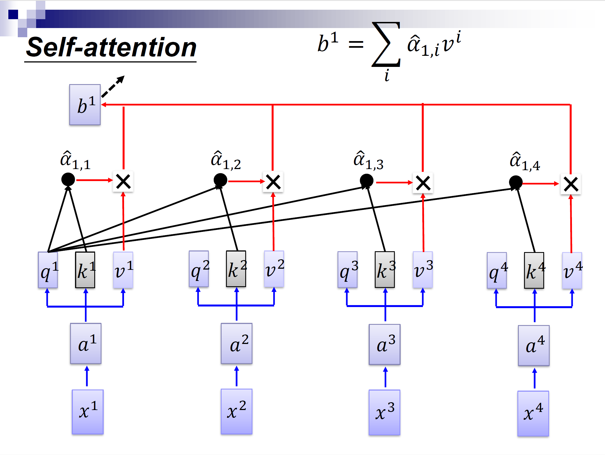

# Hw1. Self-Attention C Golden Models

## Goal

* write the C golden models for VMM, GVM, GMM, SATT
* plug SATT in an software LLM for inference to verify the correctness

## Requirements

1. vector matrix mulitplication **VMM(A, B)** returns the product of vector A and matrix B of fixed dimensions
2. general vector matrix multiplication **GVM(A, B, S1, S2)** is implemented using VMM (A: S1, B: S1xS2)
3. general matrix matrix multiplciation **GMM(C, D, S1, S2, S3)** is implemented using GVM (C: S1xS2, D: S2xS3)
4. self-attention **SATT(IN, Wq, Wk, Wv, S1, S2, S3, S4)** is implemented using GMM
5. substitute the matmul() function in run.c in https://github.com/karpathy/llama2.c for the GMM() matrix you developed, and verify for functional correctness

