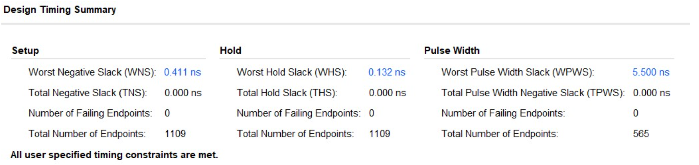
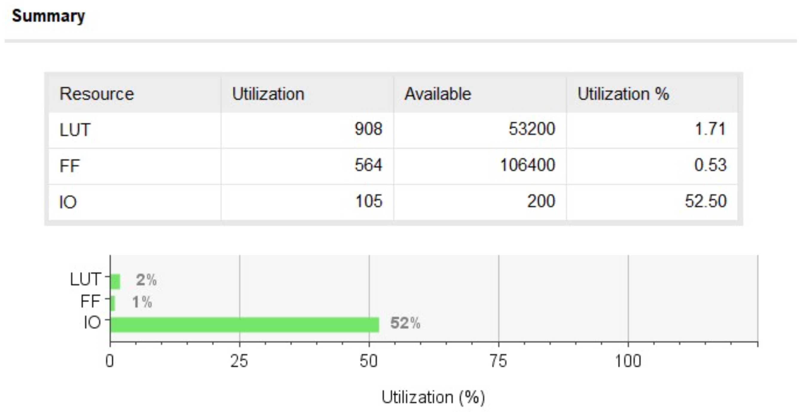
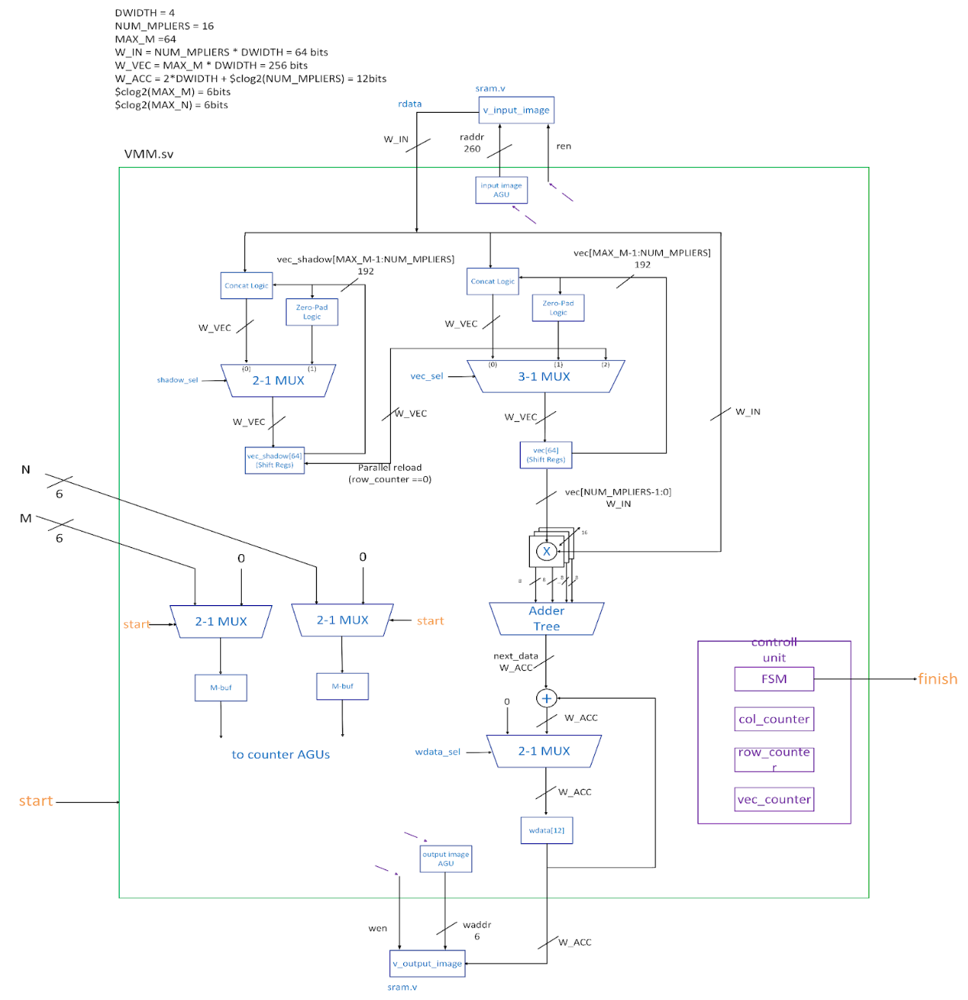
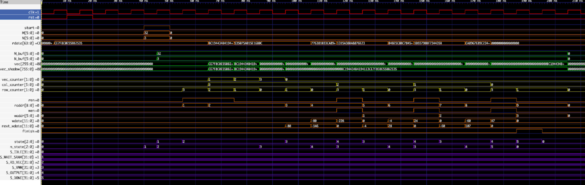
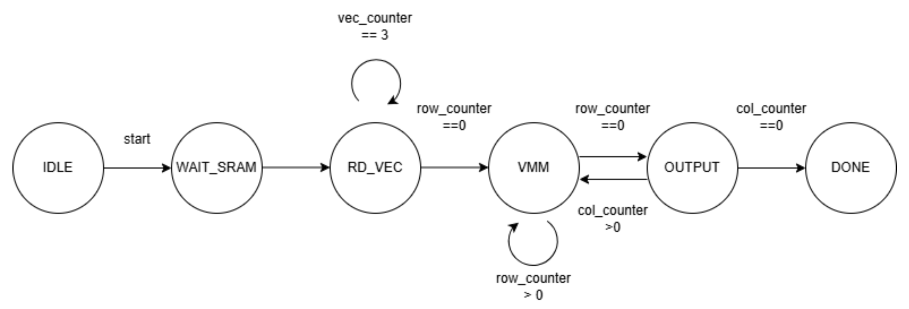

# Hw2. Vector-Matrix Multiplication Accelerator IP Circuit

<table>
    <tr>
        <td align="center"></td>
        <td align="center"></td>
    </tr>
</table>
<p align="center"></p>
<p align="center"></p>
<p align="center"></p>

## Goal

design an IP acceleration circuit that performs vector-matrix multiplication

## Requirements

* at least 16 multiplier units
* vector and matrix sizes must be configurable via input
* input vectors and matrices are stored in OCB

## Usage

1. change Verilator to the simulation tool of your choice
2. remember to pass arguments to M_SIZE and N_SIZE in the Makefile to the design (-D<define_name>=argument for Verilator)
3. enable SystemVerilog compilation (--sv for Verilator)

``` bash
$ make # defaults to M=16, N=3
```

``` bash
$ make M=M_SIZE N=N_SIZE
# specify dimensions (1xM) vector x (MxN) matrix
# M = 16, 32, or 48, 0 < N < 64
```

## File explanation

* **hw2.v** (top-level wrapper)
* **VMM.sv** (accelerator IP)
* **gen_rand.py** (simulation helper script)
    * generate a vector and a matrix of specified sizes
    * transpose and preprocess the matrix to fit the input of hardware (hardware-software co-design)
    * calculate the correct answer
    * write answer to golden.mem
* **hw2_tb.v** (testbench)
    * compare the result in the output OCB against that in golden.mem, and decide the output correctness
    * record the circuit runtime in cycles
