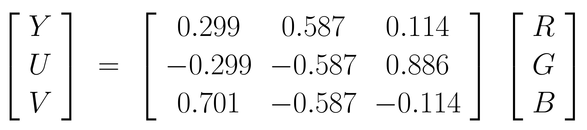
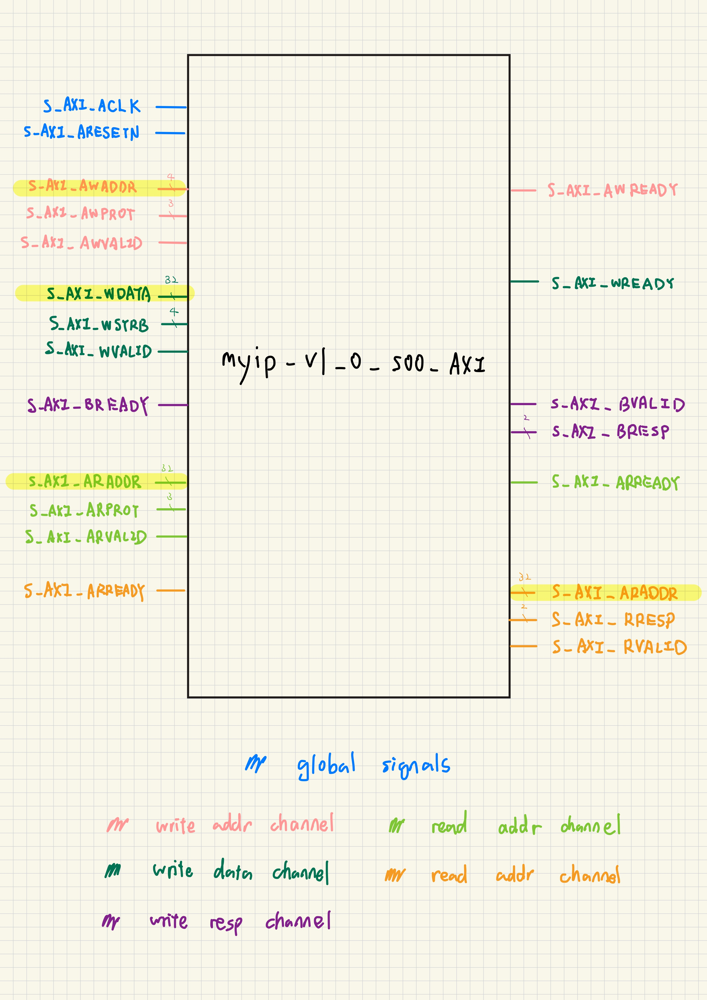

# Hw3. RGB-YUV AMBA 2.0 Conversion IP, AXI-Lite Wrapper

You are required to trace the code of a RGB-YUV conversion IP originally used in SoC development, and an AXI-Lite Wrapper. This assignment focuses on the handshaking protocol between masters and slaves and wrapper behavior.

## Task 1: RGB-YUV AMBA 2.0 Conversion IP

### 1.1 Block Diagram

    
    

    
    

### 1.2 Design Description

* **Core Function:** Performs RGB to YUV conversion using a pre-defined hardware transformation matrix.
* **PPA Optimization:** Employs 1024x scaling and top-bit extraction, allowing the synthesizer to replace costly hardware multipliers with simple 10-bit logical left-shifts to improve area and power efficiency[cite: 166].
* **Data Mapping:** Adds 128 to the U and V output channels to shift the results into entirely positive integer values.
* **AMBA 2.0:** Latches necessary control and address signals from the bus when the condition `ACRegEn = HSELIntMem & HREADYin & HTRANS[1]` evaluates to true.

---

## Task 2: AXI-Lite Wrapper

### 2.1 Block Diagram

### 2.2 Circuit Diagram

### 2.3 Design Description

* **Architecture:** Functions as a memory-mapped AXI4-Lite slave device containing four standard 32-bit readable and writable registers (`slv_reg0` through `slv_reg3`).
* **Write Transactions:** Waits for both `AWVALID` and `WVALID` to be asserted high before latching the address and capturing the write data.
* **Byte-Enable Logic:** Utilizes the `WSTRB` (Write Strobe) signal to update specific bytes individually, preventing the master from unnecessarily overwriting the entire 32-bit register[cite: 177, 264, 265].
* **Read Transactions:** Latches the requested address when `ARVALID` is high, decodes the target register, and returns the payload via `RDATA`.
* **Address Alignment:** Filters out the lower address bits that represent the byte offset using the `ADDR_LSB` parameter, ensuring proper word-aligned register selection.

### 2.4 Register Map

if **C_S_AXI_DATA_WIDTH = 64**:

| Register | Hex Offset | bit[4:0] |
|---|---|---|
| slv_reg0 | 0x00 | 00000 |
| slv_reg1 | 0x08 | 01000 |
| slv_reg2 | 0x10 | 10000 |
| slv_reg3 | 0x18 | 11000 |
