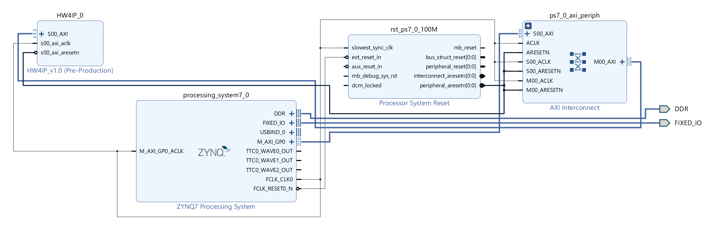
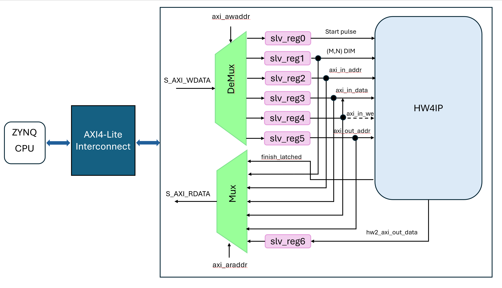
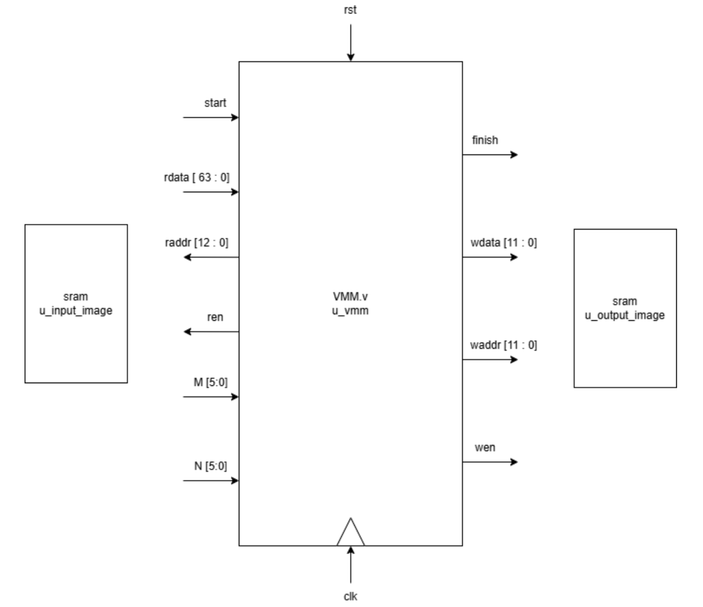
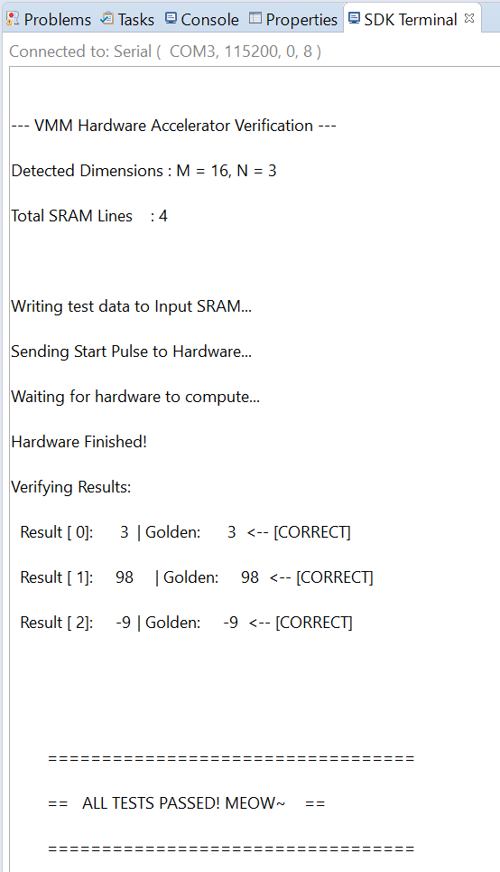

# Hw4. VMM AXI-Lite Slave IP System

Hw4 is a continuation of Hw2. Students have to wrap the hw2 VMM IP circuit in an AXI wrapper, then design a system so PS and IP (student can choose to design their IP as an slave or master) can communicate through memory-mapped I/O and finish VMM calculation.

## 1. Implementation Details

### 1.1 Data Width Conversion

- **Input side**: The input SRAM is 64-bit wide (16 INT4 values). To satisfy the bandwidth requirement, the lower 32 bits are written into the buffer register first (`REG_I_DAT_L`). When the upper 32 bits are written later (`REG_I_DAT_H`), the hardware automatically combines the two halves into one 64-bit word and writes it into SRAM during the same cycle.
- **Output side**: The VMM result is a 12-bit signed value. The hardware places it in the lower bits of a 32-bit stream. After software reads `REG_O_DAT`, it performs sign extension in C and converts the value into a correct 32-bit signed integer so negative results are preserved.

### 1.2 Control Signal Synchronization

- Because CPU register writes usually take multiple clock cycles, but the hardware state machine needs a one-cycle start pulse, an edge-triggered pulse generator is used to convert the CPU's level-sensitive write into a single-cycle `start_pulse`.
- The `finish` signal from the VMM engine only lasts one cycle, so a `finish_latched` register is added to hold the completion state until the next CPU start command clears it.

## 2. System Design and Register Map


▲ Vivado Block Design


▲ System Block Diagram

Base Address: `0x43c0000`

| Offset | Name | Register | R/W | Description |
| --- | --- | --- | --- | --- |
| `0x00` | `REG_CTRL` | `slv_reg0` | R/W | Write start signal / read finish signal |
| `0x04` | `REG_DIM` | `slv_reg1` | W | Write M and N dimensions |
| `0x08` | `REG_I_ADDR` | `slv_reg2` | W | Write the input SRAM address |
| `0x0C` | `REG_I_DAT_L` | `slv_reg3` | W | Write the lower 32 bits of the 64-bit input data |
| `0x10` | `REG_I_DAT_H` | `slv_reg4` | W | Write the upper 32 bits of the 64-bit input data and trigger the write hardware |
| `0x14` | `REG_O_ADDR` | `slv_reg5` | W | Write the output SRAM read address |
| `0x18` | `REG_O_DAT` | `slv_reg6` | R | Read the output SRAM result |

## 3. Recap: Hw2 VMM IP Circuit


▲ VMM module Block Diagram

## 4. SDK Execution

``` C
// ...

#define VMM_BASE XPAR_HW4IP_0_S00_AXI_BASEADDR

// Register Map (Offsets from VMM_BASE)
#define REG_CTRL    0x00
#define REG_DIM     0x04
#define REG_I_ADDR  0x08
#define REG_I_DAT_L 0x0C
#define REG_I_DAT_H 0x10
#define REG_O_ADDR  0x14
#define REG_O_DAT   0x18

int main() {
    // ...

    // --------------------------------------------------------
    // Step 1: Auto-derive Matrix Dimensions (M and N)
    // --------------------------------------------------------
    // N is determined by the length of the expected output vector (golden_data).
    int n_val = sizeof(golden_data) / sizeof(golden_data[0]);

    // Total number of 64-bit transactions written to the input SRAM.
    int total_input_depth = sizeof(input_data_high) / sizeof(input_data_high[0]);

    // Derive M based on the hardware packing formula:
    // total_depth = (M/16) + (M/16)*N  =>  M = (total_depth * 16) / (1 + N)
    int m_val = (total_input_depth * 16) / (1 + n_val);

    printf("Detected Dimensions : M = %d, N = %d\n", m_val, n_val);
    printf("Total SRAM Lines    : %d\n\n", total_input_depth);

    // --------------------------------------------------------
    // Step 2: Hardware Configuration
    // Write dimensions to the configuration register.
    // Assuming hardware expects [M in bits 31:8] and [N in bits 7:0].
    // --------------------------------------------------------
    u32 dim_config = (m_val << 8) | n_val;
    Xil_Out32(VMM_BASE + REG_DIM, dim_config);

    // --------------------------------------------------------
    // Step 3: Data Provisioning
    // Stream the input data chunks into the hardware's local SRAM.
    // --------------------------------------------------------
    printf("Writing test data to Input SRAM...\n");
    for(int i = 0; i < total_input_depth; i++) {
        Xil_Out32(VMM_BASE + REG_I_ADDR, i);
        Xil_Out32(VMM_BASE + REG_I_DAT_L, input_data_low[i]);
        Xil_Out32(VMM_BASE + REG_I_DAT_H, input_data_high[i]);
    }

    // --------------------------------------------------------
    // Step 4: Execution Trigger
    // Send a 1-cycle Start pulse to wake up the accelerator state machine.
    // --------------------------------------------------------
    printf("Sending Start Pulse to Hardware...\n");
    Xil_Out32(VMM_BASE + REG_CTRL, 0x01); // Assert Start bit
    Xil_Out32(VMM_BASE + REG_CTRL, 0x00); // De-assert to create a pulse

    // --------------------------------------------------------
    // Step 5: Polling (Synchronization)
    // Block the CPU and wait until the hardware asserts the Finish flag.
    // --------------------------------------------------------
    printf("Waiting for hardware to compute...\n");
    u32 status;
    do {
        status = Xil_In32(VMM_BASE + REG_CTRL);
    } while (!(status & 0x02)); // Bit 1 represents the 'Finish' signal

    // Optional: Clear the control register to reset flags for the next execution loop.
    Xil_Out32(VMM_BASE + REG_CTRL, 0x00);
    printf("Hardware Finished!\n");

    // --------------------------------------------------------
    // Step 6: Result Verification
    // Read the processed data back from the hardware and compare against Golden Model.
    // --------------------------------------------------------
    printf("Verifying Results:\n");
    int passed = 1;

    for(int j = 0; j < n_val; j++) {
        Xil_Out32(VMM_BASE + REG_O_ADDR, j);
        u32 result = Xil_In32(VMM_BASE + REG_O_DAT);

        // Sign Extension: The hardware outputs a 12-bit signed integer.
        // We must manually extend the sign bit so the 32-bit C environment interprets negatives correctly.
        int signed_res = (int)(result & 0xFFF); // Mask out upper 20 bits
        if (signed_res & 0x800) {               // Check if the 12th bit (sign bit) is 1
            signed_res |= 0xFFFFF000;           // Pad the upper 20 bits with 1s
        }

        printf("  Result [%2d]: %6d \t| Golden: %6d", j, signed_res, golden_data[j]);

        if (signed_res != golden_data[j]) {
            printf("  <-- [MISMATCH]\n");
            passed = 0;
        } else {
            printf("  <-- [CORRECT]\n");
        }
    }

    // ...
}
```


▲ SDK Execution Result