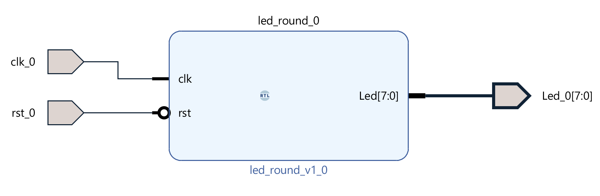

# Lab 1.1 LED Block Design Warmup

## 1. Steps

1. **Edit `LED.v`**
2. **Edit block design**
    * create block design
    * add `LED.v` by [referencing a module][1] (⚠️ we do not package `LED.v` as an IP in this lab!)
    * make ports external (so it is visible to peripherals)
    * validate design
    * create HDL wrapper
3. **Add `LED_constraint.xdc`**
4. **Generate Bitstream**
4. **Program to FPGA and check result**

[1]: https://docs.amd.com/r/en-US/ug994-vivado-ip-subsystems/Referencing-a-Module

## 2. Block Design

▲ Vivado Block Design

## 3. Demo

