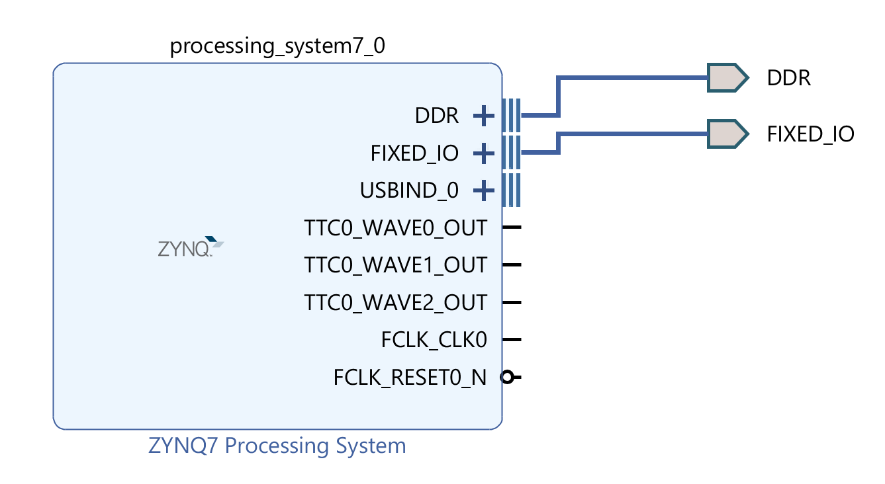
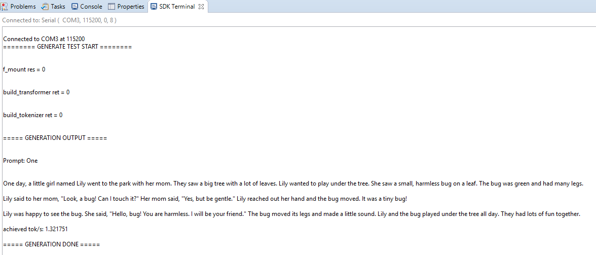

# Lab 1.2 Llama C Model Execution on ZYNQ-7000 PS

## 1. Steps

1. **Edit block design**
    * create block design
    * add `ZYNQ-7000 PS` to block diagram (disable `M_AXI_GP0`)
    * make ports external (so it is visible to peripherals)
    * validate design
    * create HDL wrapper
2. **Execute in SDK**
    * adjust the heap space to **0x50000000** in `lscript.ld`
    * enable `xilffs` in `system.mss` in BSP
    * link to `<math.h>` by adding `-m` in settings
    * add `run.h`, `run.c` to project
    * edit `helloworld.c` to inference the Llama C model
    * program to FPGA
    * run application program, and check result

## 2. Slave IP and System Design


▲ Vivado Block Design

## 3. SDK Application Program

``` C
int main()
{
    FRESULT res;
    Transformer transformer;
    Tokenizer tokenizer;
    int ret;

    char prompt[] = "One";
    int steps = 256;

    init_platform();

    printf("======== GENERATE TEST START ========\r\n");

    //** f_mount(arg_1, arg_2, arg_3)
    //** arg_2: mount the first device
    //** arg_3: 0 means delay mount (until use can check whether mount is successful)
    //          1 means immediate mount (can check whether mount is successful immediately)

    res = f_mount(&fatfs, "0:/", 1);
    printf("f_mount res = %d\r\n", res);
    if (res != FR_OK) {
        cleanup_platform();
        return 0;
    }

    ret = build_transformer(&transformer, "str15M.bin");
    printf("build_transformer ret = %d\r\n", ret);
    if (ret != 0) {
        cleanup_platform();
        return 0;
    }

    ret = build_tokenizer(&tokenizer, "tok.bin", transformer.config.vocab_size);
    printf("build_tokenizer ret = %d\r\n", ret);
    if (ret != 0) {
        free_transformer(&transformer);
        cleanup_platform();
        return 0;
    }

    printf("===== GENERATION OUTPUT =====\r\n");

    printf("Prompt: %s\r\n", prompt);

    generate(&transformer, &tokenizer, prompt, steps);
    printf("===== GENERATION DONE =====\r\n");

    free_tokenizer(&tokenizer);
    free_transformer(&transformer);

    cleanup_platform();
    return 0;
}
```


▲ SDK Execution