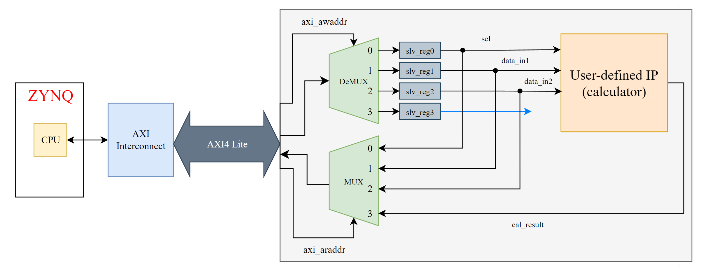
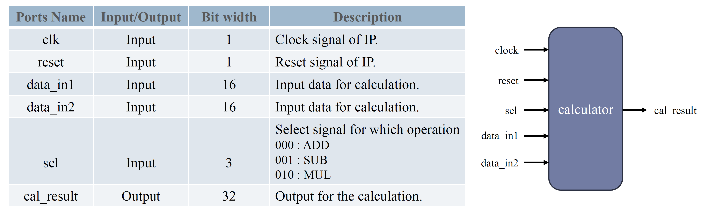
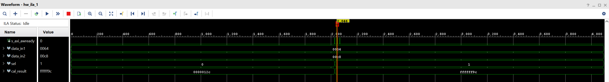
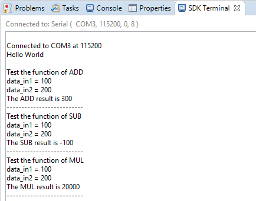

# Lab 2.2 Calculator AXI-Lite Slave IP System

## 1. Steps

1. Create and Edit Slave IP (Part 1.1)
    * create an AXI4 peripheral in IP intergrator
    * add `Calculator.v` to source
    * edit AXI wrapper
    * re-package IP in IP wizard
2. Create Hardware IP
    * add ZYNQ-7000 PS, calculator IP to block design
    * run block, connection automation wizards
    * add ILA core
    * create HDL wrapper
3. Execute in SDK (Part 1.2)
    * identify IP base address in `system.hdf`
    * modify `helloworld.c` to test our calculator slave IP
    * program to board and check execution result
4. Debug in Vivado (Part 1.3)
    * setup trigger in ILA Debugger
    * launch hardware (system debugger) in SDK
    * check ILA capture result
5. Exercise: Add a Second Slave IP in a Separate Address Space (Part 1.4)

## 2. Slave IP and System Design

▲ System Block Diagram

▲ Calculator Circuit Interface

## 3. ILA debugger

▲ ILA capture in Vivado

## 4. Demo

▲ SDK Execution in SDK
