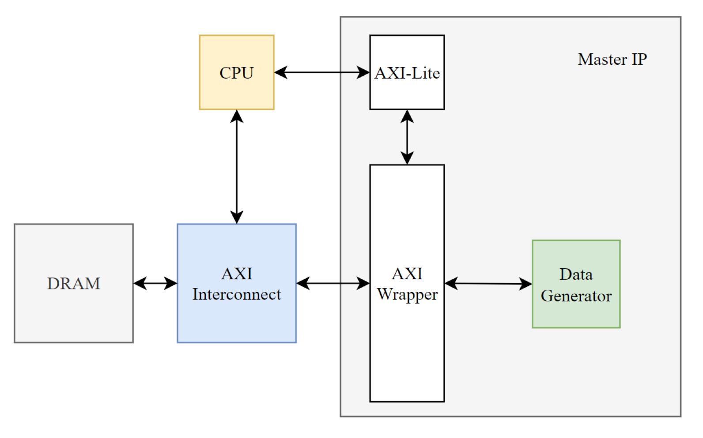
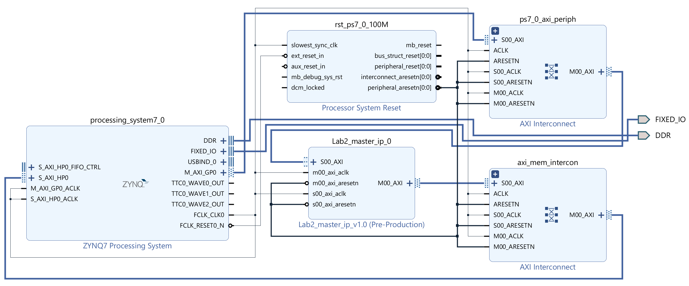
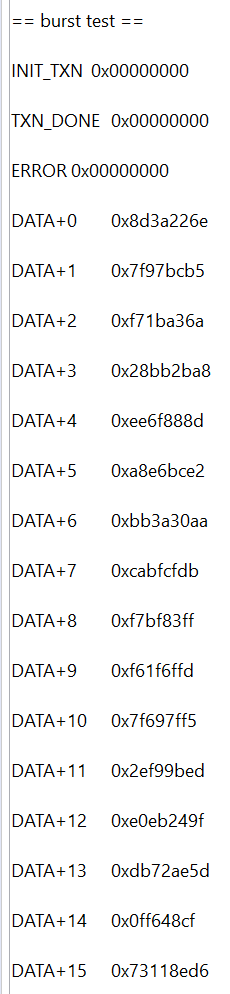

# Lab 2.2 AXI Master IP System

## 1. Steps

1. **Create and Edit Slave IP**
    * create an AXI4 peripheral in IP intergrator
    * edit AXI wrapper
    * re-package IP in IP wizard
2. **Create Hardware IP**
    * add ZYNQ-7000 PS, calculator IP to block design
    * run block automation
    * enable `S AXI HP0` interface (bridge IP: `New AXI Interconnect`)
    * set our IP's `C_M00_AXI_TARGET_SLAVE_BASE_ADDR` to 0x10000000
    * run connection automation
    * create HDL wrapper
    * generate bitstream
3. **Execute in SDK**
    * identify IP base address in `system.hdf`
    * modify `helloworld.c` to test our calculator slave IP
    * program to board and check execution result

## 2. Master IP and System Design


▲ System Block Diagram


▲ Vivado Block Design

## 3. SDK Application Program

``` C
print("== burst test == \n\r");

// pointer to address the AXI4-Lite slave
volatile int *slave = (int*)0x43c00000;

// pointer to memory address 0x10000000
volatile int *data_p = (int*)0x10000000;

// check status
printf("INIT_TXN\t0x%08x\n", *(slave+0));
printf("TXN_DONE\t0x%08x\n", *(slave+1));
printf("ERROR\t0x%08x\n", *(slave+2));

// print memory content
int i;
for (i = 0; i < 16; i++) {
    printf("DATA+%d\t\t0x%08x\n", i, *(data_p+i));
}
```


▲ SDK Execution
