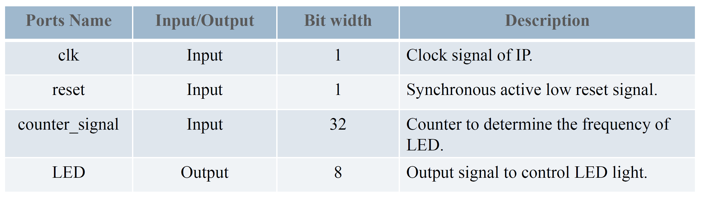
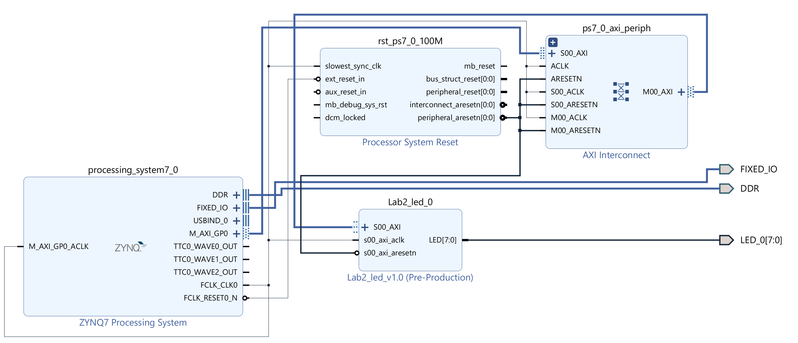

# Lab 2.3 Exercise: LED AXI-Lite Slave IP System

## 1. Steps

1. **Create and Edit Slave IP**
    * create an AXI4 peripheral in IP intergrator
    * create and write `LED.v`
    * edit AXI wrapper
    * re-package IP in IP wizard
2. **Create Hardware IP**
    * add ZYNQ-7000 PS, LED IP to block design
    * run block, connection automation
    * make `LED` port external in slave IP
    * validate design
    * create HDL wrapper
    * generate bitstream
3. **Execute in SDK**
    * identify IP base address in `system.hdf`
    * modify `helloworld.c` to test our LED slave IP
    * program to board and check execution result

## 2. Master IP and System Design


▲ LED Module Interface


▲ Vivado Block Design

## 3. SDK Application Program

``` C
print("=== LED Circular Light ===\n\r");

volatile int *base_addr = (int*)0x43c00000;

base_addr[0] = 10000000; // counter signal
```


▲ SDK Execution
