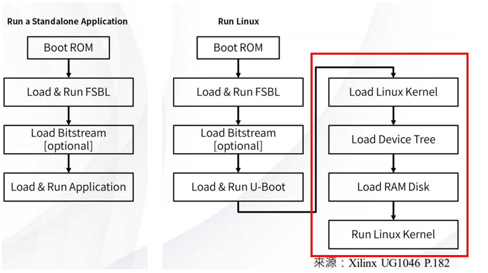
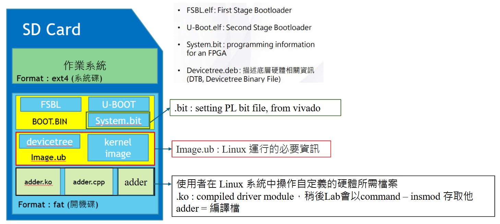
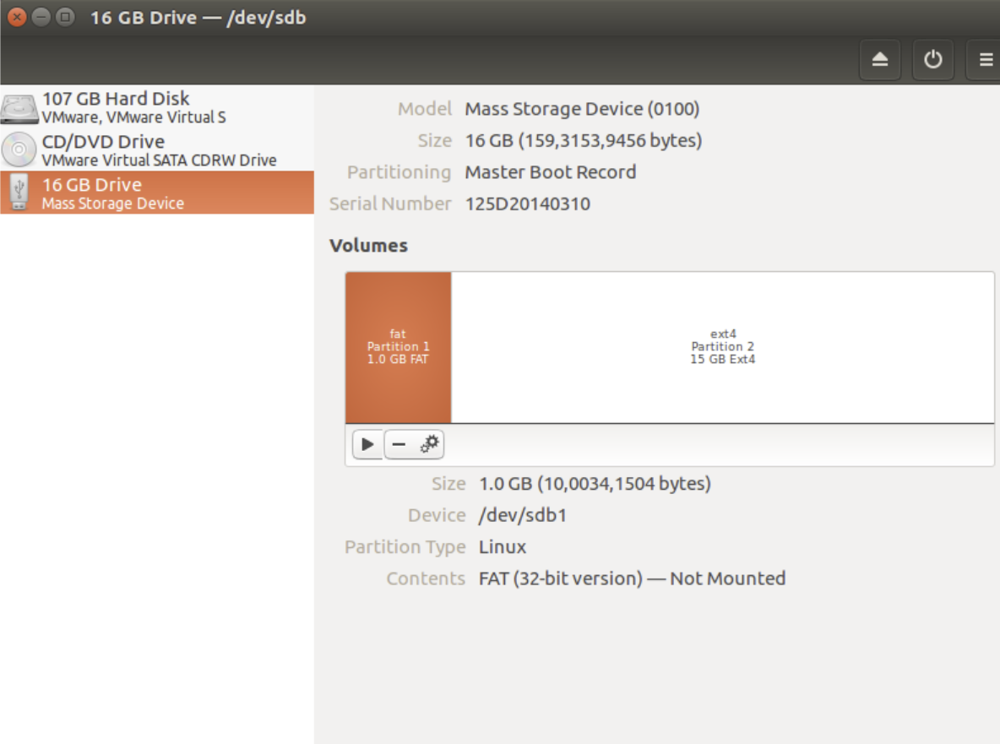
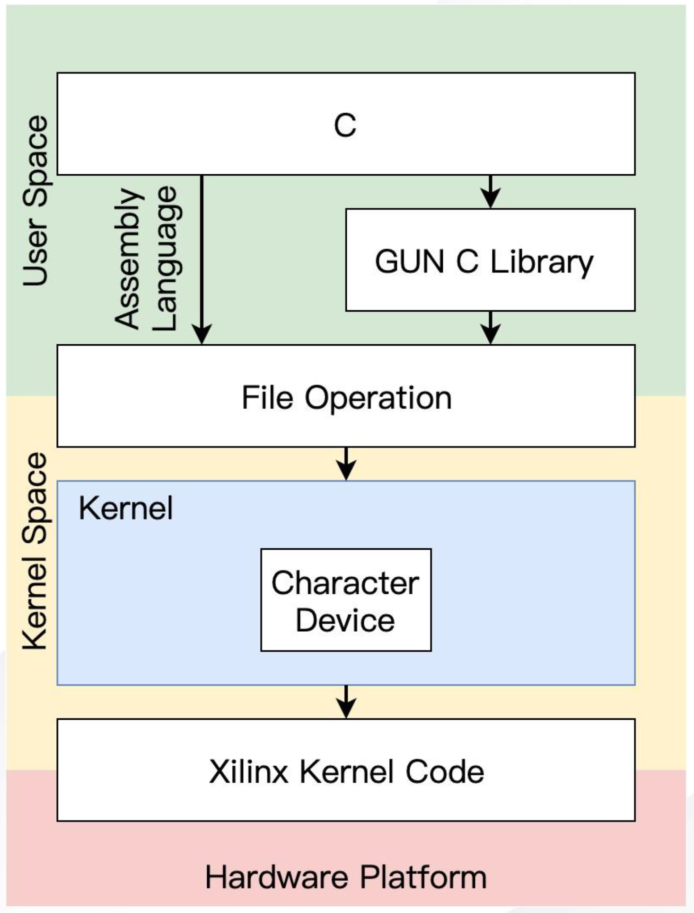
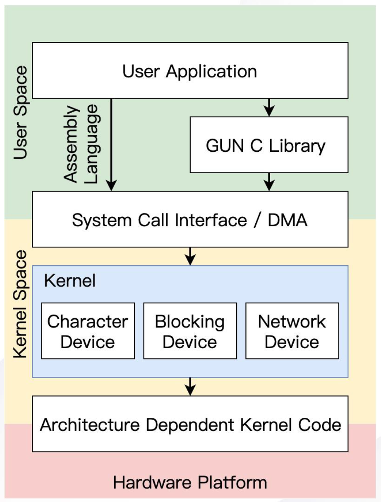
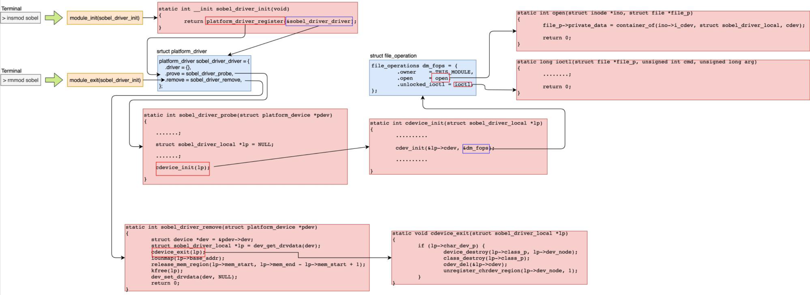

# Lab 3. Embedded PetaLinux SD Card Boot & Calculator Driver

## 1. Introduction

This lab builds a complete embedded Linux system on the Zedboard that integrates custom FPGA hardware (PL) with ARM Linux software (PS). Using PetaLinux, we generate a bootable SD card image, then write a Linux kernel driver that exposes a memory-mapped FPGA adder IP core as a character device. A user-space application communicates with the hardware through standard `ioctl` calls, demonstrating the full PS-PL co-design flow.

- This `README` preserves only key steps, please refer to `lab3.pdf` for full process.
- `avnet-digilent-zedboard-v2018.3-final.bsp` and `ArchLinuxARM-zedboard-latest.tar` are not provided here due to GitHub file size limitations.

## 2. Requirements

| Tool | Purpose |
|---|---|
| Vivado 2018.3 | Hardware design and `.hdf` export |
| PetaLinux 2018.3 | Embedded Linux build system (kernel, device tree, rootfs, `BOOT.BIN`) |
| Zedboard | Zynq-7000 SoC development board (ARM Cortex-A9 + Artix-7 FPGA) |
| Ubuntu 16.04 (VMware) | Build environment |
| MobaXterm | Serial terminal over UART |
| GParted / Disks | SD card partitioning |

## 3. Steps

1. Create PetaLinux project from board support package (`.bsp`) and import hardware description (`.hdf`) from Vivado
2. Configure root filesystem type to SD card, build kernel + rootfs, create and compile driver module
3. Generate `BOOT.BIN` (FSBL + bitstream + U-Boot)
4. Partition SD card (1 GB FAT + remaining EXT4), write rootfs, copy boot files
5. Configure SD card to allow root login without password
6. Boot Zedboard, load driver module, run adder application

## 4. Zedboard Boot Process

- **Stage 0 — BootROM:** On power-on or reset, the ARM core executes pre-stored initialization code from the on-chip BootROM.
- **Stage 1 — FSBL:** The First Stage Boot Loader initializes the PS (ARM SoC), writes the `.bit` bitstream to the PL (FPGA), and prepares DRAM for the next stage.
- **Stage 2 — U-Boot (SSBL):** Sets up the Linux boot environment (memory map, kernel args) on CPU0 and hands control to the kernel.
- **Stage 3 — Linux:** Loads the kernel image, device tree, and RAM disk, then runs the full embedded Linux system.

<p align="center"></p>

## 5. SD Card Contents

The SD card is split into two partitions:

- **Partition 1 (FAT — boot partition):** holds `BOOT.BIN` and `image.ub`, plus the user files `adder.ko`, `adder`, and `adder.cpp`
- **Partition 2 (EXT4 — system disk):** holds the full ArchLinuxARM rootfs

| File | Description |
|---|---|
| `BOOT.BIN` | FSBL + PL bitstream + U-Boot bundled into one boot image |
| `image.ub` | Linux kernel image + device tree + RAM disk |
| `adder.ko` | Compiled kernel driver module, loaded via `insmod` |
| `adder` | Compiled user-space test application |

<p align="center"></p>

## 6. Create Project & Generate Boot Files

```bash
$ source ~/build/settings.sh                      # activate PetaLinux environment

# Create project from BSP (board support package for Zedboard)
$ petalinux-create -t project -s SOPC_Driver_Lab/avnet-digilent-zedboard-v2018.3-final.bsp

$ cd avnet-digilent-zedboard-v2018.3
# Import hardware description (.hdf) exported from Vivado
$ petalinux-config --get-hw-description=/home/ta/Desktop/SOPC_Driver_Lab
# In menuconfig: Image Packaging Configuration → Root filesystem type → SD card → save → exit

$ petalinux-build                                 # build kernel, device tree, and rootfs (takes a while)

# Create a driver module scaffold named "adder"
$ petalinux-create -t modules -n adder --enable
```

> Replace the generated generic template `adder.c` with the provided `adder.c`.  
> Open `component/plnx_workspace/device-tree/device-tree/pl.dtsi`, copy the `compatible`
> string (e.g. `"xlnx,final-1.0"`), and update `adder_of_match` in `adder.c` to match.

```bash
$ petalinux-build -c adder       # cross-compile adder.c → adder.ko

# Package BOOT.BIN: FSBL + PL bitstream + U-Boot
$ petalinux-package --boot \
    --fpga images/linux/system.bit \
    --fsbl images/linux/zynq_fsbl.elf \
    --u-boot --force
```

## 7. SD Card Setup

**Partition** using Disks or GParted:
- Partition 1: 1 GB FAT (label `fat`) — **must be partition 1**
- Partition 2: remaining EXT4 (label `ext4`) — **must be partition 2**

<p align="center"></p>

**Write rootfs to EXT4:**

```bash
$ sudo apt install bsdtar
# Decompress ArchLinuxARM rootfs onto the EXT4 partition
$ sudo bsdtar -xpf ../SOPC_Driver_Lab/ArchLinuxARM-zedboard-latest.tar.gz \
    -C /media/ta/ext4
```

**Copy boot files to FAT partition:** `BOOT.BIN`, `image.ub`, `adder.ko`, `adder`, `adder.cpp`

**Allow root login without password:**  
Open `ext4/etc/security/securetty` and `ext4/etc/passwd` (via `sudo nautilus`) and remove the root password requirement, then safely eject the SD card.

## 8. Driver & Application Program

<p align="center">
    
    
</p>

### `adder.cpp`: application program

User-space test application: opens `/dev/adder-master` and runs all four arithmetic operations.

```cpp
int main(int argc, char ** argv) {

    int test_fp;

    // after insmod adder.ko, /dev/adder-master becomes available
    test_fp = open("/dev/adder-master", O_RDWR);
    if (test_fp == 0) {
        std::cout << "Can not open /dev/adder-master" << std::endl;
        return -1;
    }

    ioctl(test_fp, 0, 100);  // input_a = 100
    ioctl(test_fp, 1,  50);  // input_b = 50

    sleep(1); // wait for FPGA IP to finish computation

    std::cout << "add : " << ioctl(test_fp, 3, 0) << std::endl;  // → 150
    std::cout << "sub : " << ioctl(test_fp, 4, 0) << std::endl;  // → 50
    std::cout << "mul : " << ioctl(test_fp, 5, 0) << std::endl;  // → 5000
    std::cout << "div : " << ioctl(test_fp, 6, 0) << std::endl;  // → 2

    return 0;
}
```

Cross-compile on the VM (recommended):

```bash
$ source ~/build/settings.sh
$ arm-linux-gnueabihf-g++ -fPIE -pie adder.cpp -o adder
```

### `adder.c`: driver kernel module source code

Linux kernel module implementing a platform driver + character device at `/dev/adder-master`.

<p align="center"></p>

```c
// --------- defines & device struct ---------
MODULE_LICENSE("GPL");
#define DRIVER_NAME "adder-master"

#define input_a   0   // write operand A → FPGA register 0
#define input_b   1   // write operand B → FPGA register 1
#define output_a  3   // read add  result ← FPGA register 3
#define output_b  4   // read sub  result ← FPGA register 4
#define output_c  5   // read mul  result ← FPGA register 5
#define output_d  6   // read div  result ← FPGA register 6

struct adder_local {
    unsigned long mem_start;
    unsigned long mem_end;
    void __iomem *base_addr;   // mapped FPGA register base
    struct device *plat_dev_p;
    struct device *char_dev_p; // /dev/adder-master node
    dev_t dev_node;
    struct cdev cdev;
    struct class *class_p;
};

// --------- file operations ---------
static long ioctl(struct file *file_p, unsigned int cmd, unsigned long arg)
{
    struct adder_local *lp = (struct adder_local *)file_p->private_data;
    int __iomem *tmp = lp->base_addr;
    if (cmd > 7)
        cmd -= 64 * 1024; // normalize large ioctl numbers from user space

    switch (cmd) {
        case input_a:  tmp[0] = arg; break;  // write A
        case input_b:  tmp[1] = arg; break;  // write B
        case output_a: return tmp[3];         // A + B
        case output_b: return tmp[4];         // A - B
        case output_c: return tmp[5];         // A * B
        case output_d: return tmp[6];         // A / B
    }
    return 0;
}

static int open(struct inode *ino, struct file *file_p)
{
    // bind adder_local to file->private_data so ioctl can retrieve it
    file_p->private_data = container_of(ino->i_cdev, struct adder_local, cdev);
    return 0;
}

static struct file_operations dm_fops = {
    .owner          = THIS_MODULE,
    .open           = open,
    .unlocked_ioctl = ioctl,
};

// --------- char device lifecycle ---------
static int cdevice_init(struct adder_local *lp) { ... } // allocates region, registers cdev, creates /dev/adder-master
static void cdevice_exit(struct adder_local *lp) { ... } // destroys node, unregisters cdev, releases region

// --------- platform driver ---------
static int adder_probe(struct platform_device *pdev) { ... }  // maps IOMEM, calls cdevice_init
static int adder_remove(struct platform_device *pdev) { ... } // calls cdevice_exit, unmaps IOMEM, frees memory

#ifdef CONFIG_OF
static struct of_device_id adder_of_match[] = {
    { .compatible = "xlnx,final-1.0", }, // must match compatible in pl.dtsi
    { /* end of list */ },
};
MODULE_DEVICE_TABLE(of, adder_of_match);
#endif

static struct platform_driver adder_driver = {
    .driver = {
        .name           = DRIVER_NAME,
        .owner          = THIS_MODULE,
        .of_match_table = adder_of_match,
    },
    .probe  = adder_probe,
    .remove = adder_remove,
};

module_init(adder_init); // prints "Hello module world.", registers platform driver
module_exit(adder_exit); // unregisters platform driver
```

### How to Modify Driver

The original PetaLinux driver template only provides a Platform Driver skeleton. To let user-space communicate with the FPGA hardware, three additions are needed:

1. **Extend `adder_local`** — add char device fields (`dev_t`, `cdev`, `class *`) to hold the character device state alongside the platform device state.
2. **Add `file_operations` and `ioctl`** — define `open()` and `unlocked_ioctl()` so user-space can call `open("/dev/adder-master")` and `ioctl()` to read/write FPGA registers.
3. **Integrate into Platform Driver** — call `cdevice_init()` inside `probe()` to register the char device node; call `cdevice_exit()` inside `remove()` to clean up.

## 9. Demo

On MobaXterm, connect to the corresponding COM port and set baud rate to 115200

```
alarm login: root
[root@alarm ~]# ls
[root@alarm ~]# mkdir fat
[root@alarm ~]# mount /dev/mmcblk0p1 fat/
[root@alarm ~]# ls -la fat/
total 8468
drwxr-xr-x 2 root root    4096 Jan  1  1970 .
drwxr-x--- 4 root root    4096 Aug  8 22:29 ..
-rwxr-xr-x 1 root root 4673432 May 21  2026 BOOT.BIN
-rwxr-xr-x 1 root root    9180 May 21  2026 adder
-rwxr-xr-x 1 root root     951 May 21  2026 adder.cpp
-rwxr-xr-x 1 root root    8984 May 21  2026 adder.ko
-rwxr-xr-x 1 root root 3957632 May 21  2026 image.ub
[root@alarm ~]# ls /dev/
block            memory_bandwidth    ram0    tty    tty28  tty48   urandom
bus              mmcblk0             ram1    tty0   tty29  tty49   vcs
char             mmcblk0p1           ram10   tty1   tty3   tty5    vcs1
console          mmcblk0p2           ram11   tty10  tty30  tty50   vcs2
cpu_dma_latency  mtd0                ram12   tty11  tty31  tty51   vcs3
disk             mtd0ro              ram13   tty12  tty32  tty52   vcs4
fd               mtd1                ram14   tty13  tty33  tty53   vcs5
full             mtd1ro              ram15   tty14  tty34  tty54   vcs6
gpiochip0        mtd2                ram2    tty15  tty35  tty55   vcsa
iio:device0      mtd2ro              ram3    tty16  tty36  tty56   vcsa1
kmsg             mtd3                ram4    tty17  tty37  tty57   vcsa2
log              mtd3ro              ram5    tty18  tty38  tty58   vcsa3
loop-control     mtdblock0           ram6    tty19  tty39  tty59   vcsa4
loop0            mtdblock1           ram7    tty2   tty4   tty6    vcsa5
loop1            mtdblock2           ram8    tty20  tty40  tty60   vcsa6
loop2            mtdblock3           ram9    tty21  tty41  tty61   vga_arbiter
loop3            network_latency     random  tty22  tty42  tty62   watchdog
loop4            network_throughput  shm     tty23  tty43  tty63   watchdog0
loop5            null                snd     tty24  tty44  tty7    zero
loop6            port                stderr  tty25  tty45  tty8
loop7            ptmx                stdin   tty26  tty46  tty9
mem              pts                 stdout  tty27  tty47  ttyPS0
[root@alarm ~]# insmod fat/adder.ko
adder: loading out-of-tree module taints kernel.
<1>Hello module world.
adder-master 43c00000.final: Device Tree Probing
adder-master 43c00000.final: adder at 0x43c00000 mapped to 0xe0b30000
[root@alarm ~]# cd fat/
[root@alarm fat]# ./adder
the value is 100

the value is 50

in output_a
add : 150
in output_b
sub : 50
in output_c
mul : 5000
in output_d
div : 2
```

## 10. Conclusion

This lab demonstrated a full FPGA-Linux co-design flow on the Zedboard. We used PetaLinux to build a bootable SD card image, wrote a Linux kernel platform driver with a character device interface, and verified that user-space `ioctl` calls correctly drive the FPGA calculator IP — returning the expected add (150), sub (50), mul (5000), and div (2) results. The key takeaway is the driver architecture: the Platform Driver binds to hardware via the Device Tree `compatible` string, while the Character Device provides the `/dev/adder-master` file interface that user-space programs use through standard POSIX file operations.
